## Welcome to "PHS 7045: Advanced Programming"

Before we start the class:

- Who are you, and what do you expect to get from the class?

- Who am I, and what do I expect to get from you?

- Workflow:

  - All submissions (labs, assignments, midterm, and final) are made through [GitHub](https://github.com/UofUEpiBio/PHS7045-advanced-programming).

  - Submissions must use [Quarto](https://quarto.org), [R Markdown](https://rmarkdown.rstudio.com/), or similar (like [this presentation](https://github.com/UofUEpiBio/PHS7045-advanced-programming/blob/629f4654a6288a305261b5c7b8e51ddfed354256/lectures/01-git/slides.qmd)!).

  - Weekly readings.

  - Two weekly sessions: lecture + lab.

  - One major project to be completed: midterm and final.

- More details are in the syllabus.

Today's lesson will focus on three things: (i) we will learn about AI, (ii) we will review different applications of AI, and (iii) we will conclude with expectations about AI usage in the class.

# Part I: What is AI

## Overview of AI tools

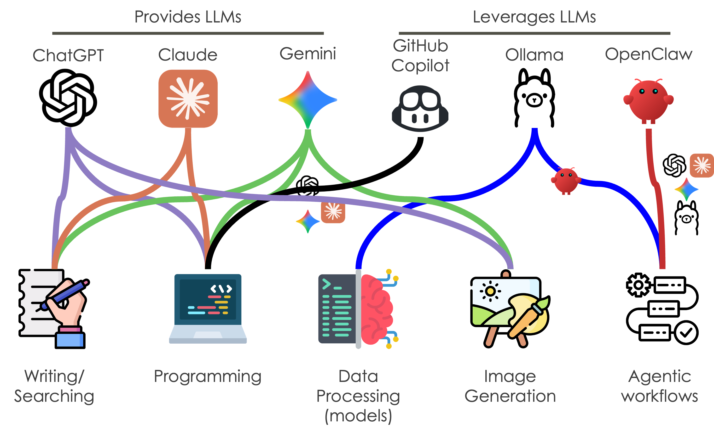

## What is an AI agent?

In principle, AI agents are a combination of three components: (a) a large language model, (b) a communication interface for the agent, and (c) a set of callable tools available to the agent. The following figure from Sumers et al. summarizes this.

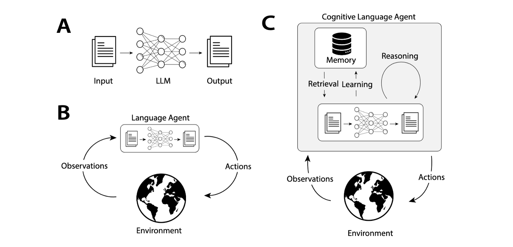

## What is an AI agent? (cont.)

The following figure (generated by an AI) provides a concrete example of an AI agent architecture:

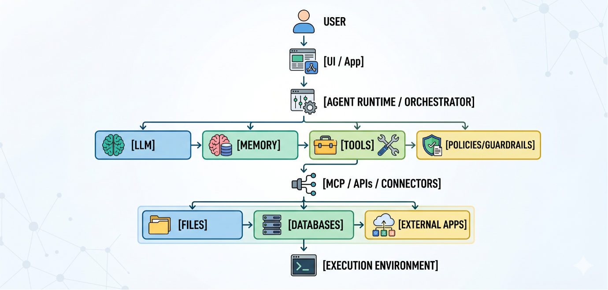

Key points to highlight from this image:

1. A UI (user interface).
2. An agent orchestrator.
3. The LLM, its memory, a set of tools, and policies/guardrails.
4. The Model Context Protocol (the standard way of connecting agents with tools).
5. Additional data resources (including API connectors).
6. An execution environment.

Let's now dive deeper into some important concepts in AI.

## AI keywords

### Context

Context refers to the information available to the AI agent as input. This includes the user prompt, as well as additional information that will be passed via an LLM. Note that the term "context" can refer not only to the amount of information we pass to an AI agent, but also to the information AI agents have access to; in other words, information that may not be used directly as part of the input to the LLM, but that the AI agent may access at some point.

The context in LLMs is an important part of how AI works. Recently, researchers have shown that LLMs have a bias when it comes to the amount of attention they pay to different parts of the context. In particular, AI agents usually pay more attention to the beginning and the end of the context. This is a good argument against using extremely large contexts in a single call.

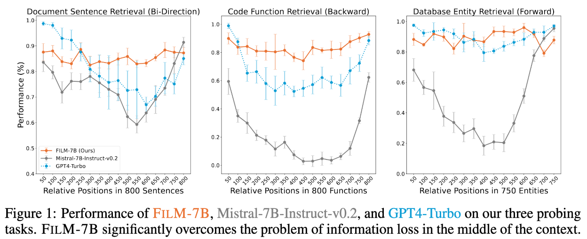

Instead of passing all the information at once, recent strategies have explicitly divided the context into multiple inputs, each processed by a different agent:

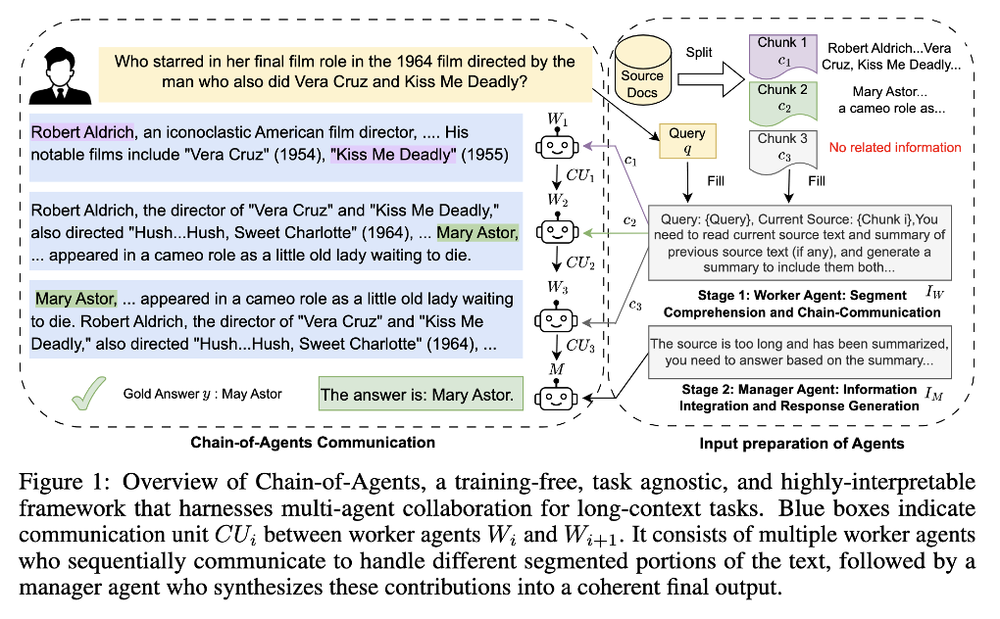

### Hallucinations and RAG

We are all too familiar with AI hallucinations, when LLMs show "creativity" and include made-up information as part of their responses. The main issue with hallucinations is that they often seem too real. This is by far one of the main problems in AI applications: how to avoid such "creativity" and anchor responses to real data.

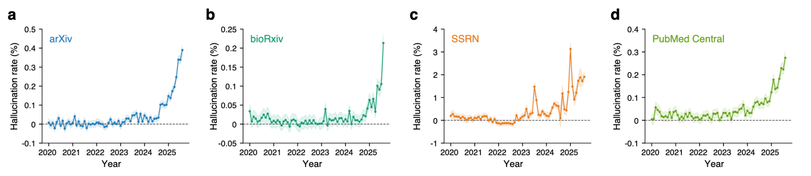

The answer is Retrieval-Augmented Generation (RAG). In a nutshell, RAG systems can be described as databases for AI agents. They provide human-curated information that AI agents can access to anchor their responses. For instance, using RAG systems, AI agents avoid providing fake citations and instead give real references the user can validate. Now, RAG systems do not completely solve hallucinations, but they help by anchoring responses to real data. Whether the paper says what the AI said it says is a different story!

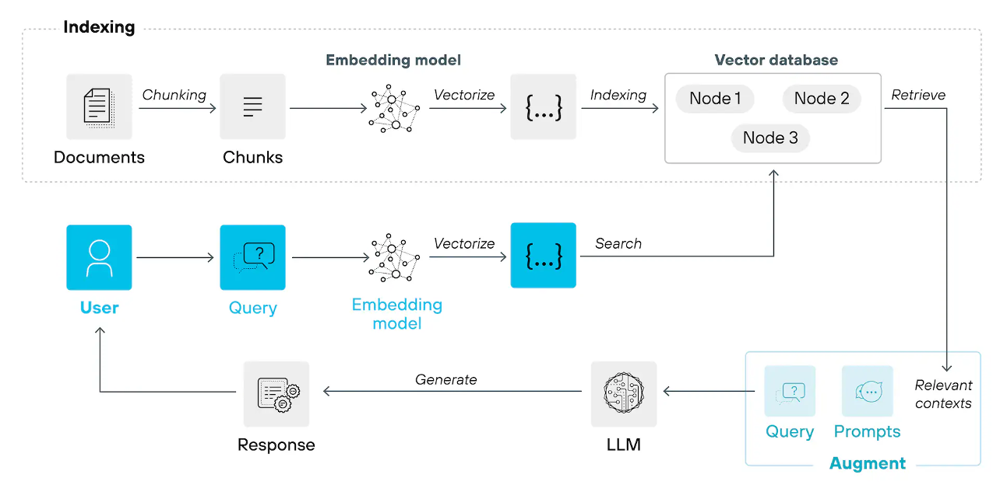

### Multimodality and Embeddings

LLMs process language, as their name suggests. Nevertheless, as we know, modern AI agents can process a variety of data types, or rather, modes. Multimodality refers to the ability of AI agents to work with different types of inputs and outputs. This can range from tools that convert binary files such as images, audio, or video into text to proper ML encoding/decoding tools that treat these modes as additional data that must be transformed into embeddings and back.

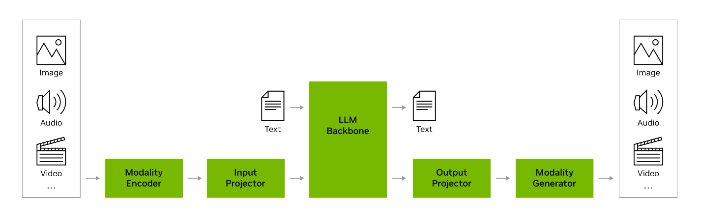

Embeddings are another powerful concept that goes beyond AI and agents. An embedding refers to a data array that represents an object numerically. For instance, text can be converted into a numerical array through different operations and then passed to a machine learning architecture. This is the core principle that AI models use: they do not literally use the text; instead, they preprocess (encode) text and other data modes into numerical representations that can be passed to the ML algorithm.

# Examples using AI

## Example 1: Translating a Book

The book "Applied Network Science with R" is a collection of lectures and tutorials that I have been working on for the last 10 years or so. The book, which started with me giving short workshops to my social network analysis group at the University of Southern California, has been (expectedly) written 100% in English. Nonetheless, coming from Chile, I wanted to have a version of the book in Spanish. To achieve this, I leveraged the fact that the entire book was a collection of Quarto documents living in GitHub.

To build the Spanish version, I created a GitHub issue that explained the problem, the required steps, and the considerations needed to achieve the goal; then I assigned an AI agent (GitHub Copilot) to work on the issue. The result was a fully translated version of the book into Spanish.

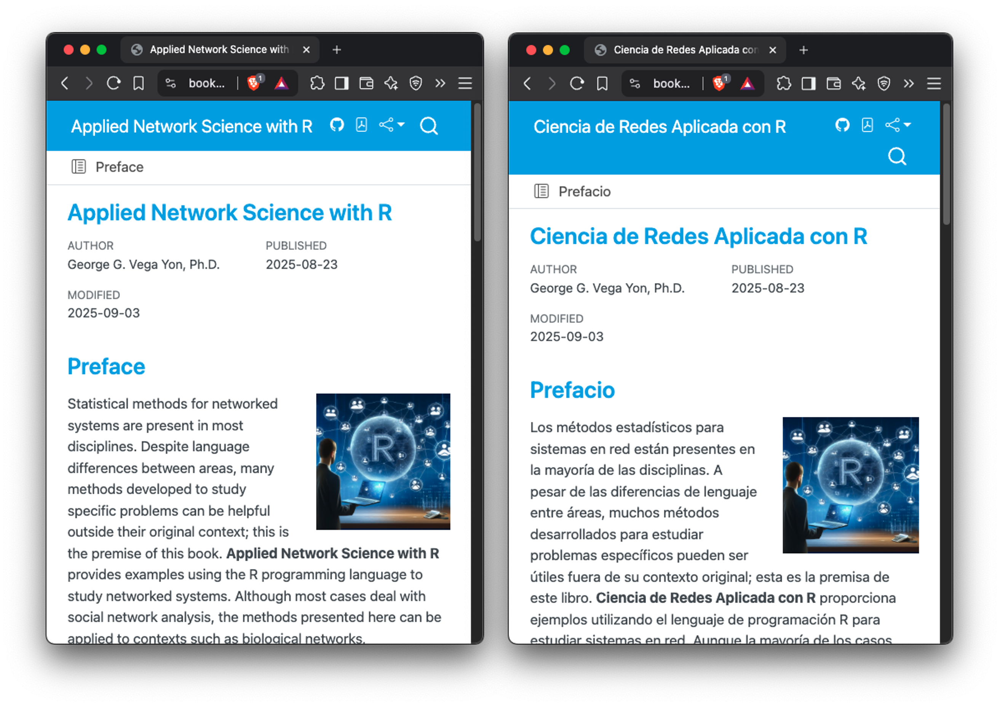

The AI skipped a couple of chapters on the first pass, but was able to translate them properly with some guidance on the second pass. The books are available at <https://book.ggvy.cl> (English) and <https://book.ggvy.cl/es> (Spanish).

The initial GitHub issue can be found at <https://github.com/gvegayon/appliedsnar/issues/5>

## Example 2:Building a New Epi Model

As part of my ongoing work with the Utah Department of Health and Human Services (DHHS), we needed to create a new version of an Agent-Based Model (ABM) that simulated measles outbreaks in the state of Utah. The original model was a simple model that assumed all agents were mixing homogeneously, meaning that kids, adults, and the elderly were interacting with each other at the same rate without differentiating contact rates or different propensities to see individuals from different groups.

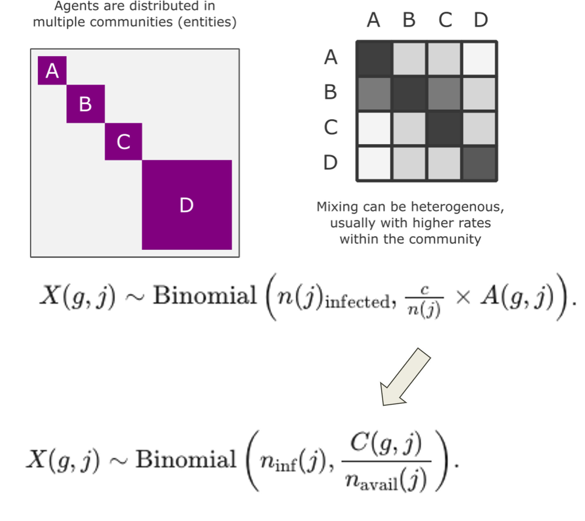

To extend the model, I needed to replace the fixed contact rate (which reflected the average number of daily contacts any agent had) with a contact matrix, which provided the needed flexibility.

To address this issue, I went back to GitHub Copilot and assigned it an issue that contained most of the important pieces needed to address it. The AI agent was able to modify the existing model to incorporate the new feature. Some important factors that helped:

1. I provided detailed instructions about what needed to be done.

2. I was using an agent within a repository, not a simple chatbot like ChatGPT, without passing information.

3. The repository already contained important information: **other existing models** that were **properly documented**, as well as an **extensive suite of tests** (hundreds) that gave the AI agent an idea of the type of testing required.

4. A set of continuous integration workflows via GitHub Actions ensured the project would not break with new changes. This way, the other existing tests should always pass, even if we change the code.

You can look at the entire sequence at <https://github.com/UofUEpiBio/epiworld/pull/220>.

## Example 3: Embeddings

I mentioned embeddings before. Embeddings can be used for more than just LLMs. One interesting application is in predictive modeling. A team of epidemiologists working with Google created a collection of spatiotemporal embeddings (meaning they included information about space and time) using search data and other geographical information for the entire US at the US census level. With this information, they then trained a machine learning algorithm that could be used to predict measles, mumps, and rubella (MMR) vaccination rates for children under 5, which were not available for the entire US.

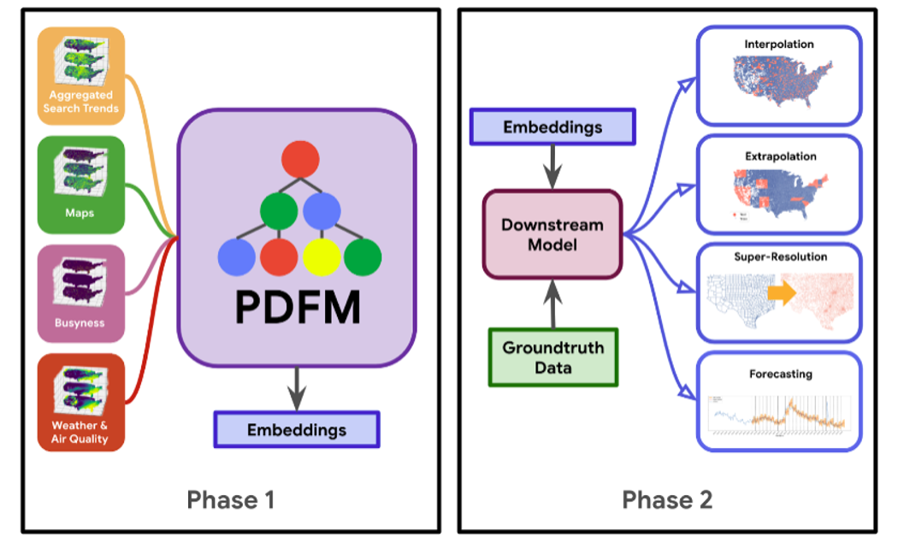

This is an interesting application because it is something econometricians (and, obviously, other statisticians) have been using systematically for a long time: proxy data. In this case, although the embeddings have no interpretation whatsoever (they are matrix representations of multiple data points), they do encode information that can be associated with things such as vaccination rates. Because of this, the Google embeddings turned out to be a great ally in predicting MMR vaccination rates.

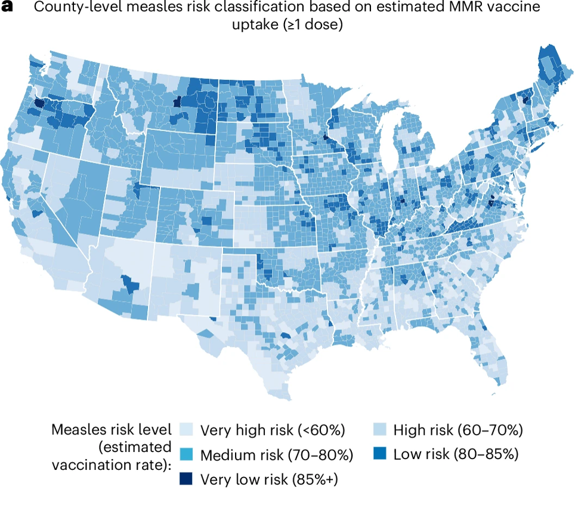

You can use embeddings of all sorts. Many LLMs (and Small Language Models, SLMs) provide embeddings you can use to process textual data, for instance. So, in addition to using natural language processing (NLP) techniques, researchers can leverage additional information that may be encoded in the text.

# How we plan to use LLMs in this class

LLMs can be a fantastic tool for accelerating software development and scientific work. Nonetheless, they can also be highly dangerous, as users may rely too much on them. For this reason, this class plans to use a hybrid approach with AI agents:

1. Students are required to use AI throughout the course.

2. Nonetheless, unless explicitly mentioned, the first solution or approach to a problem should be developed without AI agents, including completion tools, chatbots, cloud-based or desktop-based agents, etc.

3. For each piece of work created by students, you will be required to ask one or more AI agents to evaluate your work in terms of (a) the correctness of your response, (b) the efficiency of your programs, and (c) the quality of your coding.

This final diagram provides a summary of how I personally use AI agents for vibe coding (and conding tasks) in general. You can learn more about AI usage in science in my book "AI for the Scientist in a Hurry" <https://book-ai.ggvy.cl>. And a more extensive version of this presentation can be found [here](https://docs.google.com/presentation/d/14CRTzeyNbtMEPnOVolM8SRFrJ07JLoWThoMZVao3WFo/edit?usp=sharing){target="_blank"}.

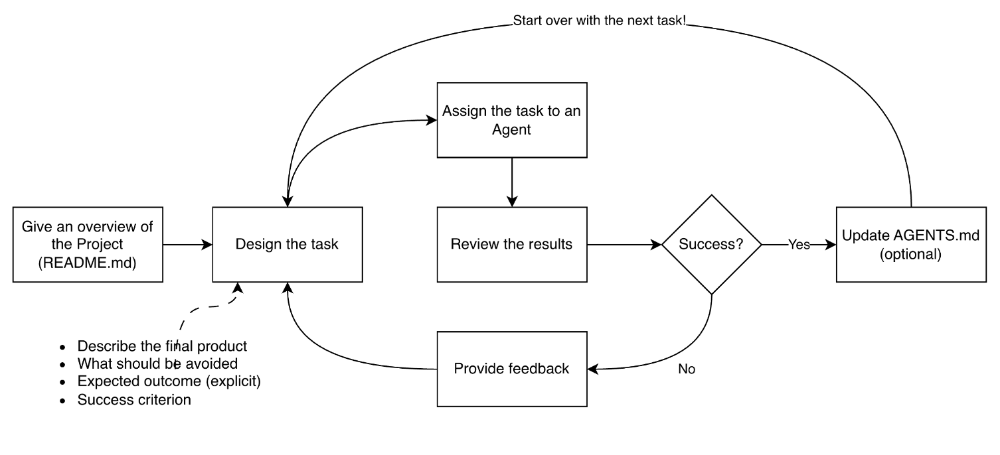

# References

