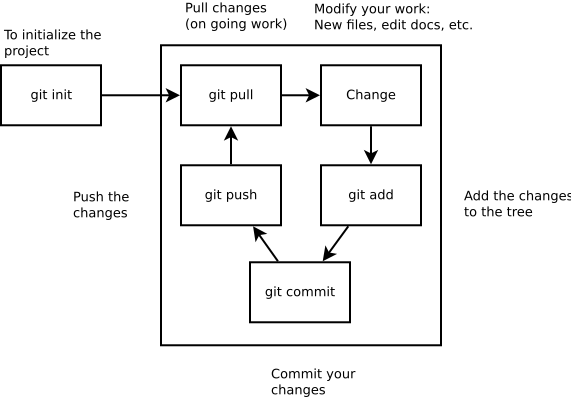
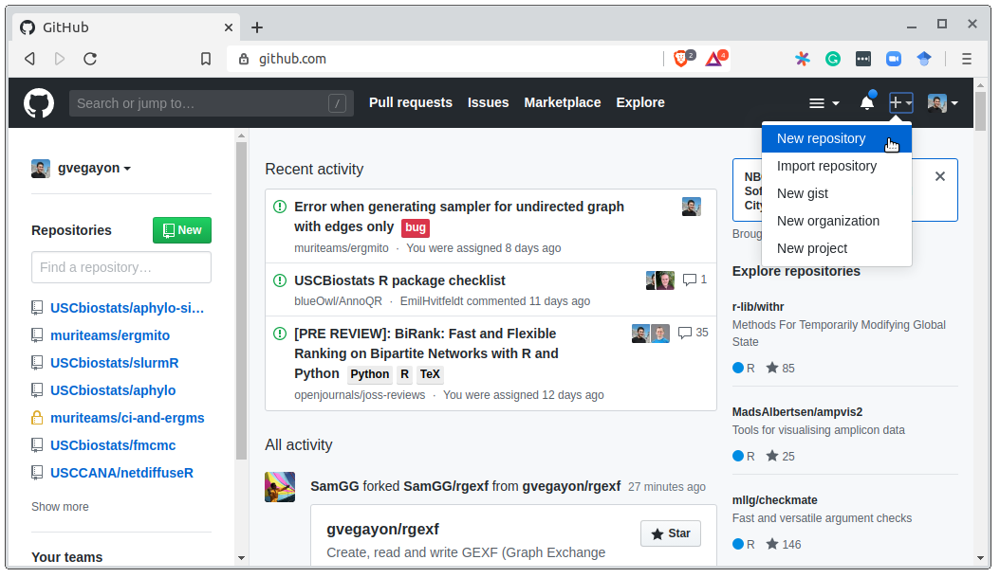
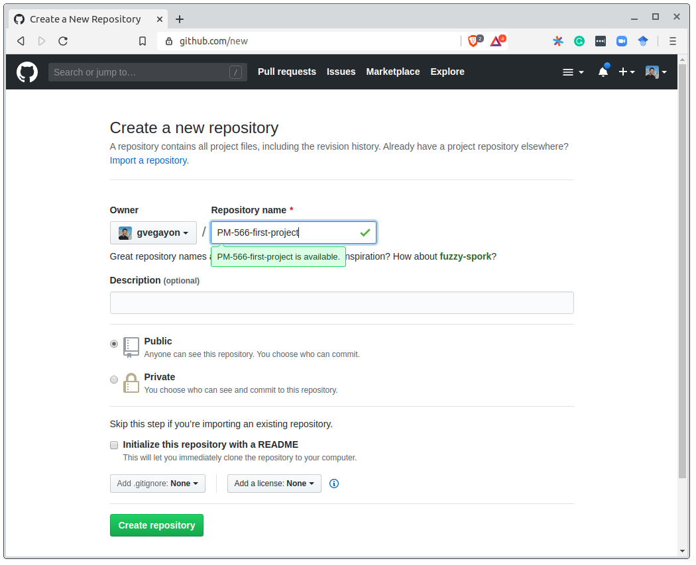

```{=html}
<style>
.filelist {
  font-family: "SFMono-Regular", Consolas, "Liberation Mono", Menlo, monospace;
  background-color: #f5f7fa;
  padding: 0.75em 1em;
}
</style>
```

# Preamble

## Today's lesson

1. We will learn about version control and GitHub.

2. Set up git and GitHub (make sure it works).

# Part I: Intro

## Brief review of technologies

::: {.r-fit-text}

Throughout the course, we will be using the following tools:

::: {.fragment .fade-right}
- [R](https://r-project.org) (duh!) 
:::

::: {.fragment .fade-right}
- [Git](https://git-scm.com/) (software) and [GitHub](https://github.com) (website).
:::

::: {.fragment .fade-right}
- [Command line tools](https://github.com/gvegayon/cli).
:::

::: {.fragment .fade-right}
- Some R GUI, e.g., [RStudio](https://posit.co/products/open-source/rstudio/) or [Visual Studio Code](https://code.visualstudio.com/).
:::

::: {.fragment .fade-right}
- [GitHub co-pilot](https://github.com/features/copilot): An AI-powered pair programmer (when OK; more on this later). 
:::
::: {.fragment .fade-right}
- [Codex](https://chatgpt.com/codex)
:::
::: {.fragment .fade-right}
- [Claude](https://claude.ai)
:::
:::

## What is 'version control.'

::: {.columns style="text-align: center"}

::: {.column width="80%"}
[I]s the <strong>management of changes</strong> to documents [...] <strong>Changes are usually identified</strong> by a number or letter code, termed the "revision number", "revision level", or simply "revision". For example, an initial set of files is "revision 1". When the first change is made, the resulting set is "revision 2", and so on. <strong>Each revision is associated with a timestamp and the person making the change</strong>. Revisions can be <strong>compared</strong>, <strong>restored</strong>, and with some types of files, <strong>merged</strong>. -- <a href="https://en.wikipedia.org/w/index.php?title=Version_control&oldid=948839536" target="_blank">Wiki</a>
:::

::: {.column width="20%"}
{fig-alt="Diagram of version-controlled project history showing branching and merging of revisions over time"}
<!--  -->
:::
:::

---

## Why do we care

::: {.columns}

::: {.column width="50%" .fragment}
You might have seen this...

```{.filelist}
mydocument.txt
mydocumentversion2.txt
mydocumentwithrevision.txt
mydocumentfinal.txt
```
:::

::: {.column width="50%" .fragment}
Or even this…

```{.filelist}
mydocument2016-01-06.txt
mydocument2016-01-08.txt
```
:::

:::

---

## Why do we care 

Have you ever:

::: {.r-fit-text}

::: {.fragment .fade-in}
- Made a **change to code**, realised it was a **mistake** and wanted to **revert** back?
:::

::: {.fragment .fade-in}
- **Lost code** or had a backup that was too old?
:::

::: {.fragment .fade-in}
- Had to **maintain multiple versions** of a product?
:::

::: {.fragment .fade-in}
- Wanted to see the **difference between** two (or more) **versions** of your code?
:::

::: {.fragment .fade-in}
- Wanted to prove that a particular **change broke or fixed** a piece of code?
:::

:::

---

## Why do we care (cont'd)

Have you ever:

::: {.r-fit-text}

::: {.fragment .fade-in}
- Wanted to **review the history** of some code?
:::

::: {.fragment .fade-in}
- Wanted to submit a **change** to **someone else's code**?
:::

::: {.fragment .fade-in}
- Wanted to **share your code**, or let other people work on your code?
:::

::: {.fragment .fade-in}
- Wanted to see **how much work** is being done, where, when, and by whom?
:::

::: {.fragment .fade-in}
- Wanted to **experiment** with a new feature **without interfering** with working code?
:::

::: {.fragment .fade-in}
In these cases, and no doubt others, a version control system should make your life easier.

-- [Stackoverflow](https://stackoverflow.com/a/1408464/2097171) (by [si618](https://stackoverflow.com/users/44540/si618))
:::

:::

## Git: The stupid content tracker 

::: {.r-fit-text}
During this class (and perhaps, the entire program), we will be using
 <!-- <a href="" target="_blank"> -->
[](https://commons.wikimedia.org/wiki/File:Git-logo.svg) 

::: {.fragment .fade-in}
- Git is used by [most developers in the world](https://insights.stackoverflow.com/survey/2018#work-_-version-control).
:::

::: {.fragment .fade-in}
- A great reference about the tool can be found [here](https://git-scm.com/book)
:::

::: {.fragment .fade-in}
- More on what's stupid about Git [here](https://en.wikipedia.org/wiki/Git#Naming).
:::

:::

---


## How can I use Git

::: {style="font-size: 90%"}
There are several ways to include Git in your work pipeline:

- Through the **command line**:

  - `git` itself -- works everywhere, including on remote servers like CHPC.

  - **GitHub CLI** [(link)](https://cli.github.com), `gh`, for everything related to GitHub.

- Through a **standalone Git GUI**: GitHub Desktop [(link)](https://desktop.github.com/)

- Through the Git support **built into your editor**:

  - RStudio [(link)](https://rstudio.com/products/rstudio/features/)

  - Visual Studio Code [(link)](https://code.visualstudio.com/docs/sourcecontrol/overview)

More alternatives [here](https://git-scm.com/download/gui).
:::

---

## A Common workflow

{fig-alt="Git workflow" fig-align="center" width="auto"}

::: {style="font-size: 80%"}
Git has a ton of features, but the daily workflow only features a handful of commands: `git pull`, `git add`, `git commit`, and `git push`. 
:::


---

## A Common workflow

::: {style="font-size: 80%"}

1. Start the session by pulling (possible) updates: `git pull`

::: {.fragment .fade-in}
2. Make changes
  
   a. (optional) Add untracked/new files: `git add [target file]`
  
   b. (optional) Stage modified files: `git add [target file]`
  
   c. (optional) Revert changes: `git checkout [target file]`
:::
  
::: {.fragment .fade-in}
3. Move changes to the staging area (optional): `git add`
:::

::: {.fragment .fade-in}
4. Commit:

   a. If nothing pending: `git commit -m "Your comments go here."`
  
   b. If modifications are not staged: `git commit -a -m "Your comments."`
:::

::: {.fragment .fade-in}
5. Upload the commit to the remote repo: `git push`.
:::

:::

---

# Part II: Hands-on local git repo

## Hands-on 0: Introduce yourself

First, install git in your system (if you haven't done so already). You can find instructions [here](https://git-scm.com/book/en/v2/Getting-Started-Installing-Git).

Next, set up your git install with `git config`, start by telling who you are


```ssh
$ git config --global user.name "Juan Perez"
$ git config --global user.email "jperez@treschanchitos.edu"
```

Try it yourself (5 minutes). 

More on how to configure git <a href="https://git-scm.com/book/en/v2/Customizing-Git-Git-Configuration" target="_blank">here</a>. 

---

## Hands-on 1: Local repository

::: {style="font-size: 80%"}

We will start by working on our very first project. To do so, you are required to start using Git and GitHub so you can share your code with your team. For now, you can skip Github. For this exercise, you need to

::: {.fragment .fade-in}
a.  Create a new folder with the name of your project (you can try
   `PHS7045-first-project`)
:::
   
::: {.fragment .fade-in}
b.  Initialize git with `git init` command.
:::

::: {.fragment .fade-in}
c.  Create a [`README.md`](https://en.wikipedia.org/wiki/README) file and write a
    brief description of your project.
:::
   
You can find more information about the `README.md` file [here](https://docs.github.com/en/github/creating-cloning-and-archiving-repositories/about-readmes)

Note: Need a text editor? Check out this website [link](https://alternativeto.net/software/vim/).

:::
---

## Hands-on 1: Local repository (cont'd)

::: {.r-fit-text}


d.  Add the file to the tree using the `git add` command, and check the status.


::: {.fragment .fade-in}
e.  Make the first commit using the `git commit` command adding a message, e.g.

    ```sh
    $ git commit -m "My first commit ever!"
    ```

    And use `git log` to see the history.
:::

:::

---

---

## Looking at history: `git log`

::: {.r-fit-text}

```bash
git log --oneline
```

```{.default}
a3f9c21 Add sensitivity analysis for PM2.5 lag
7b2e0d4 Fix column names in cleaning script
e91c5aa Add data cleaning script
c0d8f13 Initial commit
```

::: {.incremental}
- One line per commit, **newest first**
- `a3f9c21` = short hash, a unique ID for that commit (like a DOI)
- Full `git log` shows author, date, and full message — press `q` to exit
:::

**Note**: Every commit gets a unique ID computed from its contents, so it's a fingerprint
rather than a sequential number. The first 7 characters are enough to refer to it.

:::

---


## Hands-on 1: Local repository (solution)

The following code is fully executable (copy-pastable)

::: {style="font-size: 80%"}

```sh
# (a) Creating the folder for the project (and getting in there)
mkdir ~/PHS7045-first-project
cd ~/PHS7045-first-project

# (b) Initializing git, creating a file, and adding the file
git init

# (c) Creating the Readme file
echo An empty line > README.md

# (d) Adding the file to the tree
git add README.md
git status

# (e) Committing and check out the history
git commit -m "My first commit ever!"
git log
```

:::

---

## Hands-on 1: Local repository

Ups! It seems that I added the wrong file to the tree, you can remove files from the tree using `git rm --cached`, for example, imagine that you added the file `class-notes.docx` (which you are not supposed to track), then you can remove it using

```sh
$ git rm --cached class-notes.docx
```

This will remove the file from the tree **but not from your computer**. You can go further and ask git to avoid adding Docx files using the [.gitignore file](https://git-scm.com/book/en/v2/Git-Basics-Recording-Changes-to-the-Repository#_ignoring)


---

# Part III: A (Very) Short History of Git 

## Version control is 50+ years old
- SCCS (1972) → RCS (1982) → CVS (1986) → Subversion (2000) moved from single files to whole projects to multiple developers to atomic commits.
- Git's major change: Every clone holds the full history, not only a working copy. This makes it a **distributed** version control system (DVCS).

---

## Origin story 

- **1991–2002**: Linux kernel developed via emailed patches, no formal version control

::: {style="font-size: 45%"}

```{.email}
From: torvalds@klaava.Helsinki.FI (Linus Benedict Torvalds)
Newsgroups: comp.os.minix
Subject: What would you like to see most in minix?
Summary: small poll for my new operating system
Date: 25 Aug 91 20:57:08 GMT
Organization: University of Helsinki

Hello everybody out there using minix -

I'm doing a (free) operating system (just a hobby, won't be big and
professional like gnu) for 386(486) AT clones. This has been brewing
since april, and is starting to get ready. I'd like any feedback on
things people like/dislike in minix, as my OS resembles it somewhat
(same physical layout of the file-system (due to practical reasons)
among other things).

I've currently ported bash(1.08) and gcc(1.40), and things seem to work.
This implies that I'll get something practical within a few months, and
I'd like to know what features most people would want. Any suggestions
are welcome, but I won't promise I'll implement them :-)

Linus (torvalds@kruuna.helsinki.fi)

PS. Yes - it's free of any minix code, and it has a multi-threaded fs.
It is NOT protable (uses 386 task switching etc), and it probably never
will support anything other than AT-harddisks, as that's all I have :-(.
```

:::

---

## Origin story (cont'd)

- **2002**: Kernel team adopts **BitKeeper**, a proprietary Distributed Version Control System, free to use for open source projects

::: {.incremental}
- **April 2005**: Free license revoked after a licensing dispute
- **April 2005**: Torvalds writes **Git** from scratch in ~one week
- **2008 onward**: **GitHub** launches – a web-based hosting service for Git repositories, with additional features like bug tracking, feature requests, task management, and wikis for every project.
:::

---


# Part IV: Hands-on cloud

## Git is not GitHub

::: {style="font-size: 80%"}

So far, everything we have done is **local**: `git init`, `git add`, `git commit`. No account,
no internet, no company involved. That is the whole point of a *distributed* version control
system -- you have the complete history of your project on your laptop (`.git` folder).

::: {.fragment .fade-in}
| | |
|---|---|
| **Git** | The software. Free, open source, runs on your laptop. |
| **GitHub** | A *website* that hosts Git repositories and adds collaboration tools on top. |
:::

::: {.fragment .fade-in}
GitHub is not the only option -- [GitLab](https://gitlab.com), [Bitbucket](https://bitbucket.org),
and [Codeberg](https://codeberg.org) do the same thing. 

We use GitHub because that is where the scientific software community lives.
:::

::: {.fragment .fade-in}
Nothing you have learned so far changes. GitHub is just **another copy of your repository that
happens to live on someone else's computer**.
:::

:::

---

## What does GitHub add?

::: {style="font-size: 80%"}

- **A backup and a central copy**: your laptop dies, your work does not.


::: {.fragment .fade-in}
- **Collaboration**: issues (to-do lists that anyone can file), pull requests (proposed changes),
  and code review -- this is how you will submit your work in this class.
:::

::: {.fragment .fade-in}
- **Visibility**: a public record of what you have built. For better or worse, this is a
  professional portfolio.
:::

:::

---

## What does GitHub add? (cont'd)

::: {style="font-size: 80%"}


- **Automation** ([GitHub Actions](https://github.com/features/actions)): run your tests, or
  re-render a report, every time you push.


::: {.fragment .fade-in}
- **Publishing** ([GitHub Pages](https://pages.github.com)): free websites straight from a repo.
  The website for this course is one.
:::

::: {.fragment .fade-in}
- **Reproducibility**: a repo can be archived with a permanent DOI (e.g. via
  [Zenodo](https://zenodo.org)) so a paper can cite the *exact* code that produced its results.
:::

:::

---

## The vocabulary you need

::: {style="font-size: 80%"}

::: {.fragment .fade-in}
- **`git clone`**: download a full copy of an existing repository (history included).
:::

::: {.fragment .fade-in}
- **Remote**: a copy of your repository somewhere else. Each remote has a short name, so you don't have to retype the URL. By convention the
  main one is called **`origin`**.
:::

::: {.fragment .fade-in}
- **`git push`**: send *your* commits to the remote.
:::

::: {.fragment .fade-in}
- **`git pull`**: bring the remote's commits down to you.
:::

:::

---

## The vocabulary you need (cont'd)

::: {style="font-size: 80%"}

::: {.fragment .fade-in}
- **Fork**: *your* copy of somebody else's repo, living on GitHub under your account.
:::

::: {.fragment .fade-in}
- **Pull request (PR)**: "please pull my changes into your repository" -- a proposal, plus a
  place to discuss it.
:::

::: {.fragment .fade-in}
A repo can have several remotes. Local and remote history are separate until you `push` or `pull`.
:::

:::

---

## Before we continue: get an account

::: {style="font-size: 80%"}

If you do not have one yet, sign up at [github.com](https://github.com).

::: {.fragment .fade-in}
- Pick a username you would be happy to put on a CV. It is hard to change later, and it will
  appear in every URL you share.
:::

::: {.fragment .fade-in}
- Use an email you will keep after graduation (you can add your university address as a
  secondary one).
:::

::: {.fragment .fade-in}
- GitHub **requires two-factor authentication** for accounts that contribute code. Set it up now
  rather than at the deadline.
:::

::: {.fragment .fade-in}
- As a student, apply for the [GitHub Education](https://education.github.com) benefits --
  free Copilot, among other things.
:::

:::

---

## First: how does GitHub know it is you?

::: {style="font-size: 80%"}

Before pushing anything, we need to talk about credentials. Since **August 2021**, GitHub no
longer accepts your account password for Git operations. You have two options:

::: {.fragment .fade-in}
1. **HTTPS + Personal Access Token (PAT)**: you generate a token on GitHub
   (Settings > Developer settings > Personal access tokens) and paste it *where the password
   used to go*.
:::

::: {.fragment .fade-in}
2. **SSH keys**: you generate a key pair once, give GitHub the public half, and never type
   anything again.
:::

::: {.fragment .fade-in}
**Good news**: the GitHub CLI sets all of this up for you -- we will get there right after
doing it the hard way.
:::

:::

---

## Credential helpers

::: {style="font-size: 80%"}

A **credential helper** stores your token so you are not asked every single time:

```sh
# macOS
git config --global credential.helper osxkeychain

# Windows (installed with Git for Windows)
git config --global credential.helper manager

# Linux
git config --global credential.helper libsecret
```

::: {.fragment .fade-in}
With SSH keys you do not need one -- the key *is* the credential.
:::

:::

---

## Hands-on 2: Remote repository

::: {style="font-size: 70%"}

Now that you have something to share, your teammates are asking you to share the code with them. Since you are smart, you know you can do this using something like Gitlab or Github. So you now need to:

a. Create an online repository (empty) for your project using [Github](https://github.com).

b. Add the remote using `git remote add`, in particular

  ```sh
  $ git remote add origin https://github.com/[your user name]/PHS7045-first-project.git
  ```
  
  Then, use the commands `git status` and `git remote -v` to see what's going on.
  
c. Push the changes to the remote using `git push` like this:
   
  ```sh
  $ git push -u origin main
  ```
  
  You should also check the status of the project using `git status` to see what Git tells you about it. Origin is the tag associated with the remote repo setup, while 'main' is the tag associated with the current branch of your repo.


:::

---

## Hands-on 2: Remote repository (solutions a)

<div style="text-align: center;">
  <figure>
    
  </figure>
  <!-- <figcaption><b>A common git workflow</b></figcaption> -->
</div>

---

## Hands-on 2: Remote repository (solutions a)

<div style="text-align: center;">
  <figure>
    
  </figure>
  <!-- <figcaption><b>A common git workflow</b></figcaption> -->
</div>

---

## Hands-on 2: Remote repository (solutions b)

::: {style="font-size: 85%"}

For part (b), there are a couple of solutions, first, you could try using your ssh-key (if you set it up)

```sh
# (b)
git remote add origin git@github.com:gvegayon/PHS7045-first-project.git
git remote -v
git status
```

Otherwise, you can use the HTTPS URL. The first push will ask for your username and a **personal access token** (not your GitHub password). Your credential helper stores it after that.

```sh
# (b)
git remote add origin https://github.com/gvegayon/PHS7045-first-project.git
git remote -v
git status
```

:::

---

## Hands-on 2: Remote repository (solutions c)

For the first `git push`, you need to specify the source (main) and target (origin) and set the upstream (the `-u` option):

```sh
# (c)
git push -u origin main
git status
```
The `--set-upstream`, which was invoked with `-u`, will set the tracking reference for `pull` and `push`.

**Note**: Older repos may use `master` instead of `main` — GitHub switched the default in 2020.

---

## Getting updates: `fetch` vs `pull`

::: {.columns}
::: {.column width="50%"}
### `git fetch`

Download new commits, update `origin/main`

- Your files: **unchanged**
- Your `main`: **unchanged**
- Safe to run anytime
:::

::: {.column width="50%"}
### `git pull`

`git fetch` + `git merge`

- Your files: **updated**
- Your `main`: **updated**
- Conflicts? You deal with them now
:::

**Note**: `git merge` here just means "bring those commits into my branch" — we'll see what
happens when two people change the same lines later. 

:::

---

## Branches: parallel lines of history

```{mermaid}
%%| fig-width: 6
gitGraph
  commit id: "c0d8f13"
  commit id: "e91c5aa"
  branch sensitivity-analysis
  checkout sensitivity-analysis
  commit id: "1a2b3c4"
  commit id: "5d6e7f8"
  checkout main
  commit id: "7b2e0d4"
```

::: {style="font-size: 85%"}
- A branch is just a **name pointing to the latest commit**
- `main` keeps working
- You experiment on the side on `sensitivity-analysis`
- Nothing touches `main` until you `git merge`
:::

. . .

```bash
git switch -c sensitivity-analysis   # create + move to it
git switch main                      # go back
git branch                           # list, * marks current
```

---

## The GitHub CLI (`gh`)

::: {style="font-size: 80%"}

`git` knows nothing about GitHub -- it only knows about *remotes*. Everything else
(creating repos, pull requests, issues) usually means opening a browser.

[`gh`](https://cli.github.com) is GitHub's official command line tool: it puts the *website*
part of GitHub in your terminal.

::: {.fragment .fade-in}
Installing it:

```sh
# macOS
brew install gh

# Windows
winget install --id GitHub.cli

# Linux (Debian/Ubuntu)
sudo apt install gh
```
:::

::: {.fragment .fade-in}
Why we care in this class: it works over SSH on a remote server (like CHPC), where a
GUI is not an option.
:::

:::

---

## `gh auth login`

::: {style="font-size: 80%"}

Run it **once** per machine:

```sh
gh auth login
```

::: {.fragment .fade-in}
It asks you a handful of questions and then:

- authenticates you through the browser (no token copy-pasting),
- offers to **generate an SSH key and upload it** to your GitHub account,
- runs `gh auth setup-git`, so plain `git push`/`git pull` are authenticated too.
:::

::: {.fragment .fade-in}
To check what is going on:

```sh
gh auth status
```
:::

:::

---

## Hands-on 2, redux: the one-line version

::: {style="font-size: 80%"}

Everything we just did by hand in Hands-on 2 -- create the repo on the website,
`git remote add`, `git push -u` -- is a single command from **inside** your local repo:

```sh
cd ~/PHS7045-first-project
gh repo create PHS7045-first-project --public --source=. --remote=origin --push
```

::: {.fragment .fade-in}
- `--source=.` tells `gh` to use the repo in the current folder (instead of creating an empty one)
- `--remote=origin` adds the remote for you
- `--push` pushes and sets the upstream
- use `--private` if you would rather not share it with the world
:::

:::

---

## Other `gh` commands worth knowing


```sh
# Clone one of your repos (no URL typing)
gh repo clone UofUEpiBio/PHS7045-advanced-programming

# Fork someone else's repo and clone your fork in one step
gh repo fork UofUEpiBio/PHS7045-advanced-programming --clone

# Open the current repo in your browser
gh browse
```

::: {.fragment .fade-in}
Pull requests -- how you will be submitting your work:

```sh
gh pr create --title "Lab 1" --body "My solution"
gh pr status              # what is waiting on me?
gh pr checkout 42         # check out someone else's PR locally
gh pr view 42 --web
```
:::

::: {.fragment .fade-in}
`gh pr checkout 42` is worth the install on its own -- doing that by hand means
fetching a branch from a fork you have not configured.
:::


---

## Not a terminal person?

::: {style="font-size: 90%"}

[GitHub Desktop](https://desktop.github.com) is a free GUI that covers the everyday workflow.

::: {.fragment .fade-in}
- *Add > Create new repository* or *Add existing repository* -- this is `git init`.
:::

::: {.fragment .fade-in}
- The **Publish repository** button = create the repo on GitHub + `git remote add` + `git push -u`,
  in one click (the same thing `gh repo create` did).
:::

::: {.fragment .fade-in}
- It is good at two things the command line makes awkward: **reading diffs before you commit**,
  and **staging individual lines**.
:::

::: {.fragment .fade-in}
Caveats: **no official Linux version** (so it is not an option on CHPC). 
:::

:::

---

## So which one should I use?

::: {style="font-size: 70%"}

| | Terminal (`git` + `gh`) | GitHub Desktop | RStudio / VS Code |
|---|---|---|---|
| Create + publish a repo | `gh repo create` | one click | limited |
| Daily add/commit/push | yes | yes | yes |
| Reading diffs, staging lines | awkward | **best** | good |
| Works on CHPC | **only option** | no | no |
| Pull requests, issues | `gh pr`, `gh issue` | partial | via extensions |

::: {.fragment .fade-in}
There is no wrong answer -- they all drive the same `.git` folder, and you can switch between them
in the same repository, even on the same day.
:::

::: {.fragment .fade-in}
My advice: **learn the command line**, because it is the only one that works everywhere. Use a GUI
for reviewing your changes before committing.
:::

:::

---

## Example for .gitignore

Example extracted directly from Pro-Git [(link)](https://git-scm.com/book/en/v2/Git-Basics-Recording-Changes-to-the-Repository#_ignoring).

<pre style="font-size: 12pt;">
# ignore all .a files
*.a

# but do track lib.a, even though you're ignoring .a files above
!lib.a

# only ignore the TODO file in the current directory, not subdir/TODO
/TODO

# ignore all files in any directory named build
build/

# ignore doc/notes.txt, but not doc/server/arch.txt
doc/*.txt

# ignore all .pdf files in the doc/ directory and any of its subdirectories
doc/**/*.pdf
</pre>


# Resources

::: {.r-fit-text}

- Git's everyday commands, type `man giteveryday` in your terminal/command line.
  and the very nice [cheatsheet](https://github.github.com/training-kit/).

- My personal choice for nightstand book: The Pro-git book (free online) [(link)](https://git-scm.com/book)

- Github's website of resources [(link)](https://try.github.io/)

- The "Happy Git with R" book [(link)](https://happygitwithr.com/)

- Roger Peng's Mastering Software Development Book Section 3.9 Version control and Github [(link)](https://bookdown.org/rdpeng/RProgDA/version-control-and-github.html)

- Git exercises by Wojciech Frącz and Jacek Dajda [(link)](https://gitexercises.fracz.com/)

- Learn Git Branching -- visualizes the commit graph as you type commands [(link)](https://learngitbranching.js.org/)

- Oh My Git\! -- an open-source game for learning git [(link)](https://ohmygit.org)

- Checkout GitHub's Training YouTube Channel [(link)](https://www.youtube.com/user/GitHubGuides)

:::

# Bonus: Git under the hood {visibility="uncounted"}

::: {style="font-size: 80%"}
Everything so far was *how to drive* Git. These three slides are *what it is doing* --
we will only cover them if we have time to spare.
:::

---

## What `git init` actually creates


`git init` creates exactly one thing: a hidden folder.

```sh
$ git init my-project && ls -A my-project/.git
HEAD  config  description  hooks/  info/  objects/  refs/
```

::: {.fragment .fade-in}
- `objects/` -- **the database**: every version of every file, every commit.
:::

::: {.fragment .fade-in}
- `refs/` -- names for commits. **A branch is not a copy of anything**: `refs/heads/main`
  is a file holding one 40-character hash.
:::

::: {.fragment .fade-in}
- `HEAD` -- one line saying *where you are*: `ref: refs/heads/main`. You are always standing
  somewhere in the graph; this is the file that remembers where.
:::

::: {.fragment .fade-in}
- `config` -- repo settings, including your remotes (what `git remote add` writes).
:::

::: {.fragment .fade-in}
- `index` -- **the staging area**, as a file (appears after your first `git add`).
:::

::: {.fragment .fade-in}
Copy `.git/` and you have copied the entire history. That is what "distributed" means:
your clone is not a checkout, it is the whole repository.
:::


---

## Three kinds of objects

::: {style="font-size: 55%"}

Everything in `objects/` is one of three things:

::: {.fragment .fade-in}
- **blob** -- the *contents* of a file. No name, no path, no timestamp. Just bytes.
:::

::: {.fragment .fade-in}
- **tree** -- a *directory listing*: names + permissions pointing at blobs and other trees.
:::

::: {.fragment .fade-in}
- **commit** -- a snapshot: one tree, the parent commit(s), author, date, and your message.
:::

::: {.fragment .fade-in}
Read them yourself with `git cat-file`:

```sh
$ git cat-file -p HEAD           # the commit
tree 0f1d3b...
parent 8f2c1a...
author Juan Perez <jperez@treschanchitos.edu> 1755302400 -0600

My first commit ever!

$ git cat-file -p HEAD^{tree}    # its directory listing
100644 blob ed4b46d...    README.md
```
:::

::: {.fragment .fade-in}
A commit is **not a diff** -- it points at a full snapshot. The diffs in `git log -p` are
computed on the fly by comparing two trees.
:::

:::

---

## Content hashing

::: {style="font-size: 55%"}

An object's name **is** the SHA-1 hash of its contents: same input, same 40 characters, every
time -- and you cannot go backwards from the hash to the file.

```sh
$ echo "An empty line" | git hash-object --stdin
ed4b46dc10026c8bfe58aad14387e038a41f32ca
```

::: {.fragment .fade-in}
Same content $\Rightarrow$ same hash $\Rightarrow$ **stored once**. Copy a file into ten folders and
Git stores one blob; the ten trees just point at it.
:::

::: {.fragment .fade-in}
Change one byte $\Rightarrow$ new blob $\Rightarrow$ new tree $\Rightarrow$ new commit hash. Git does
not watch your files -- it re-hashes them and compares.
:::

::: {.fragment .fade-in}
A commit's hash covers its tree *and* its parent's hash, so it covers all the history behind it.
Rewriting anything old (`git rebase`, `git commit --amend`) changes every hash after it -- which
is why rewriting *pushed* history causes trouble for collaborators.
:::

::: {.fragment .fade-in}
The hash is also a checksum: corrupt a file in `.git/objects` and Git will notice.
:::

::: {.fragment .fade-in}
Two likely questions: *could two files hash to the same name?* In principle yes, in practice
never (and Git now also supports SHA-256). *Must I type 40 characters?* No -- the first 7 do:
`git show ed4b46d`.
:::

:::

