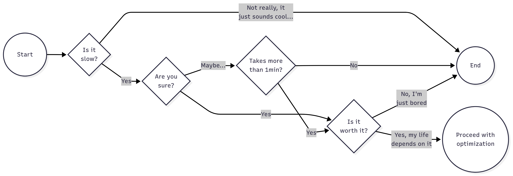
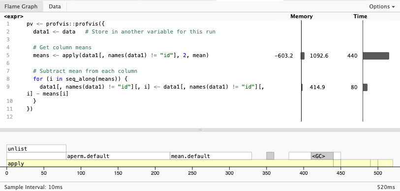
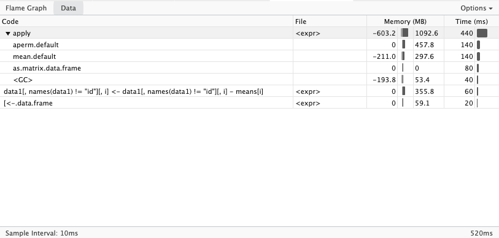

::: {.callout-note}
The profiling section of this lecture was taken directly from the "Applied HPC R" ([link](https://book-hpc.ggvy.cl){target="_blank"}) book by George G. Vega Yon, Ph.D. The debugging component was adapted from Jonathan Chipman's adapted lecture from the "Advanced R" book by Hadley Wickham, Ph.D. ([link](https://adv-r.hadley.nz/){target="_blank"}).
:::

## Profiling

Code profiling is a fundamental tool for programmers. With profiling, it is possible to **identify potential bottle necks in your code**, as well as exessive memory usage. Some important things to consider when profiling your code:

- **It has a stochastic component**: Unrelated to computational complexity, a program can exhibit different performance characteristics across different runs. This means that you should always profile your code multiple times and take the average performance as the final result.

- **It is worthless if the program is too quick**: Most of the time, code profiling must be done on programs that take a noticeable amount of time to run. If a program runs too quickly, the overhead of the profiling itself can skew the results. If you still need to address this, you can, for example, do multiple runs or use a larger dataset to increase the run time of the program.

- **Don't do it too early**: Most of the time, developers tend to optimizing (and thus profiling) their code too early. You don't want to spend time doing code profiling on something that could quickly change. So it is better to do it on a working code rather than pieces of it.
  
  Instead of profiling the code too early, make sure that you have a good design and implementation plan.

- **Be strategic**: Not everything needs to be optimized. Focus on the parts of the code that are critical for performance and user experience. You can think of it in terms of how much time the program/user spends on each bit.

- **AI can give you good tips**: In my personal experience, AI can be useful doing code profiling too. This works better if you are using an [agentic AI](https://en.wikipedia.org/w/index.php?title=Agentic_AI&oldid=1305674453){target="_blank"}, as it is more likely to get good feedback from it (it will test the code for you).

Here is a proposed workflow for profiling and optimizing your code in general

### A proposed workflow

Here is a formula to follow when doing code profiling/optimization:

1. Ask yourself these questions before you jump into profiling:

<!-- https://mermaid.live/edit#pako:eNpNUNFO4zAQ_BVrXy6RQkTatGmjEydoywnpQCfgBZQXt942vou9leOoF5L--9ktBN52PDM7s-5gQwIhh21Fh03JjWW_HgvN2HUQPFkHw_Di4uqmu6uZtN_X5qp2uh9Hr7hxRP-Cdb_org2ylpoT3xj8wj-QZQZ5VbXR-4I_TW1ZTY0WNdsQVXEc98sgWGkRht628LZ73q7RM6vumf_Fmiky6N225JolSmqfMch9i9vPjgcytnTzucdqUAzogfrl2X57hhG7-6aGdmsXJjzyqneNWxAx1bJKbk9FBO7Rn0DaBfU_g-C3oQ2iYAdpSy-gvZVKvnErSYchRLAzUkBuTYMRKDSKewidTyjAlqiwgNyNAre8qWwBhT46257rVyL14TTU7ErIt7yqHWr2gltcSr4zXA2vxjVDs3B_bCEfTU47IO_gH-TJPIuTNBml09E0uRxnkzSCFvLxPE7HWZrNp7PxZJ5NZ8cI3k6pl_Esmxz_A2q8spU -->
{fig-alt="Figure showing a silly diagram about when to profile. Generally, you only want to do that if it is taking more than a few seconds."}

2. If you succeed, then ensure that the profiling is done in a finite time, this is, use a subset of the data to avoid having long waits. **Running the profiler will add overhead computing time, so try to keep it short (e.g., 1 minute)**.

3. There may be many things that could be optimized, focus on what would deliver the highest impact. Could be a function that is only called once but takes a long time to execute, or a function that is called multiple times but is relatively fast.

4. Before making any changes, ensure that you have a backup of your original code, as well as a copy of the current profiling results. **You should also ensure to save (if possible) the outcome of the code.**

5. Re-run the profiler and compare performance. If no changes are observed, then go back to step 2. **Ensure the new version of the code maintains the same functionality as the original (check the results).**

### Profiling code in R

In the R programming language, the most used profiling tool comes with the [`profvis` package](https://cran.r-project.org/package=profvis). The package provides a wrapper of the `Rprof` function, which is a built-in R function for profiling code. The `profvis` package makes it easier to visualize the profiling results in a web-based interface.

To use `profvis`, you first need to install it from CRAN:

```r
install.packages("profvis")
```

Then, you can use it to profile your R code like this:

```R
library(profvis)

profvis({
  # Your R code here
})
```

This will execute the code and generate a visualization of the profiling results in a new browser window. You can also save the output using the `htmlwidgets` package:

```r
pv <- profvis({
  # Your R code here
})

htmlwidgets::saveWidget(pv, "profvis.html")
```

Once open, you will see two visualizations: the flamegraph and the data. The flamegraph is one of the most useful visualizations. It directly maps the time and memory used by each line of code



The data visualization shows the distribution of time spent in each function. Using a tree structure, which allows taking deep dives into the call stack.



::: {.callout-tip}
When developing R packages, it is a good idea to pair your `profvis::profvis` call with `devtools::load_all()` to ensure that all source code is available to the profiler. Otherwise, the flamegraph won't show your code (it will say "unavailable").
:::

### Exercise: Identifying the bottle neck[^bottleneck]

[^bottleneck]: Code copied verbatim from the `profvis` R package [here](https://profvis.r-lib.org/articles/examples.html#example-2){target="_blank"}.

```{r}
#| label: slow-code
#| cache: true
# Generate data
times <- 4e5
cols <- 150
data <- as.data.frame(x = matrix(rnorm(times * cols, mean = 5), ncol = cols))
data <- cbind(id = paste0("g", seq_len(times)), data)

pv <- profvis::profvis({
  data1 <- data   # Store in another variable for this run

  # Get column means
  means <- apply(data1[, names(data1) != "id"], 2, mean)

  # Subtract mean from each column
  for (i in seq_along(means)) {
    data1[, names(data1) != "id"][, i] <- data1[, names(data1) != "id"][, i] - means[i]
  }
})

htmlwidgets::saveWidget(pv, "profvis-slow-code.html")

# In interactive mode, we can directly view the profiling results
if (interactive())
  print(pv)
```


<iframe src="profvis-slow-code.html" width="100%" height="600px"></iframe>

Can you identify where is the bottleneck in the code? What would you do to speed it up?

## Debugging

## Interactive debugging 

For a more in-depth consideration of debugging, see [https://adv-r.hadley.nz/debugging.html](https://adv-r.hadley.nz/debugging.html). The examples below are from this book.


In R-Studio, notice the "Debug" drop-down menu.  Under "on error" it has three options:

1. Message only: Provides the error
2. Error Inspector: Provides the error + `traceback` and `debugonce` options
3. Break in Code: Provides the error + enters `debugonce`

The `traceback` function lists call that provided the error and any sub-calls prior to it.

Options to debug a function from top-to-bottom:

* `debug` and `(undebug)`
* `debugonce`

This will interactively walk you through the function call with the following commands:

* `n`: next line of code
* `s`: step into the next function
* `f`: continue forward through the current `{}` code block (example, a loop or the rest of the function)
* `c`: continue the rest of the function to see if it'll complete as anticipated
* `Q`: quit interactive 
* `where`: shows the trace stack (the possibly multiple layers of a function call)
* `any r command` may be run when in debugger mode

An example where `f()` calls `g()` which calls `h()` which calls `i()` which is a function with conditional logic ...

```{r, eval=FALSE}

f <- function(a) g(a)
g <- function(b) h(b)
h <- function(c) i(c)
i <- function(d) {
  if (!is.numeric(d)) {
    stop("`d` must be numeric", call. = FALSE)
  }
  d + 10
}

# Traceback and debug using Rstudio 'Rerun with Debug'
f("a")

# Enter debugging mode for a function until deactivating debugging mode
debug(f)
f("a")
f("a")
undebug(f)

# Enter debug mode for a single call
debugonce(f)
f("a")
f("a")
```


`View` and `debug` are good ways to learn the underlying code to a function.

```{r,eval=FALSE}
View(lm)
debugonce(lm)
lm(1:10~1,method = "model.frame")
```


You can use the `browser` function to enter debugging mode partially through a function

```{r, eval=FALSE}
f <- function(x, remainder){
  
  # Step 1, add 1 to even elements
  x[x%%2] <- x[x%%2] + 1
  
  # Step 2, see if each value in sequence is even or odd
  out <- x %% remainder
  
  if(length(unique(out))!= 2) browser()
  
  # Step 2, for elements with 0 remainder, add 1
  x[out == 0] <- x[out == 0] + 1
  
  # Step 3, report number of unique elements
  length(unique(x))

}
f(x=1:10,remainder=3)
```


The browser function can be helpful if you want to debug a loop mid-way through iterations.

```{r, eval=FALSE}
f <- function(){
  for (i in 1:10^5){
    print(i)
    if(i == 100) browser()
  }
}
f()
```


While embedding `browser` into code can be helpful, you must remember to remove the browser calls when done.  Rstudio also provides a feature to set breakpoints by clicking on the line-number where you'd want to start debugging.  See also [breakpoints](https://adv-r.hadley.nz/debugging.html#breakpoints).

Using the urn problem, set breakpoints and run through `debugonce()`.


