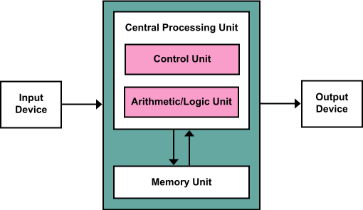
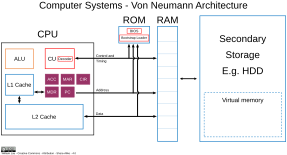

::: {.callout-note}
These slides are adapted from a lecture by George G. Vega Yon, Ph.D. ([link](https://ggvy.cl){target="_blank"}).
:::

## Introduction

::: {.incremental}
Learning objectives:

- Understand the **basics of C++** programming: syntax, types, and classes.
- Learn how to **write a simple C++ program**, compile it, and run it.
- Understand the **differences between C++ and R**.

We will need a compiler:

-  Windows: You can download Rtools [from here](https://cran.r-project.org/bin/windows/Rtools/).
    
-  MacOS: It is a bit complicated... Here are some options:
    
    *  CRAN's manual to get the clang, clang++, and gfortran compilers
    [here](https://cran.r-project.org/doc/manuals/r-release/R-admin.html#macOS).
    
    *  A great guide by the coatless professor
    [here](https://thecoatlessprofessor.com/programming/r-compiler-tools-for-rcpp-on-macos/)

- If you don't have compiler installed, you can join the class via posit.cloud.
:::

# Why C++? {background-color="black"}

## When R is not enough

> You profiled your code and vectorized what you could. It's still slow. Now what?

::: {.incremental}
- Some problems **can't be vectorized**: each step depends on the previous one.
    - MCMC samplers, agent-based models, stochastic simulations, recursive filters.
- R is **interpreted and dynamically typed**; C++ is **compiled and statically typed**.
    - For loop-heavy code, speedups of **10--100x** are common.
:::

## You already depend on C++

You already rely on C++ every day:

::: {.incremental}
- **Stan**, **data.table**, **dplyr**, **ranger**, **xgboost**, **glmmTMB**
- **Rcpp** is one of the most depended-upon packages on CRAN.
:::

. . .

Learning C++ means you can write the fast part yourself *and* read the source of
the packages you depend on.


# A first program {background-color="black"}

## Hello world

The program

::: {layout="[55,45]" .incremental}

```cpp
#include<iostream> // <1>

int main() { // <2>
  std::cout << "Hello world"
            << std::endl; // <3>
  return 0; // <4>
}
```
1. The equivalent to `library()` in R. This is part of the standard library.
2. C++ is type-explicit, so we **always** declare what are the data types.
3. Like in R, we have namespaces. We access the `cout` function from `std` (standard library). Also, the code ends with semicolon (`;`).
4. Explicit return.
:::

We can use `g++` to compile the code (`-std=c++14` is the C++14 standard):

```{bash}
#| echo: true
#| label: hello-compile
g++ -std=c++14 hello-world.cpp -o hello-world
./hello-world
```

# How your code actually runs {background-color="black"}

## Two words we just used

::: {.incremental}
**Compiler**: a program that translates your `.cpp` source code into machine code
your CPU can run directly.

**Standard**: the official version of the C++ language, revised every few years.

- C++11, C++14, C++17, C++20, C++23 --- each adds features and syntax.
- `-std=c++14` tells the compiler *which* version of the language to read your
  file as. Code using a C++17 feature will not compile under `-std=c++14`.
- We use C++14 because it is what R and Rcpp assume by default.
:::

## The stored-program computer (1945)

::: {.columns}
::: {.column width="52%"}
{width="100%"}

::: {style="font-size: 50%"}
Diagram by Kapooht, [Wikimedia Commons](https://commons.wikimedia.org/wiki/File:Von_Neumann_Architecture.svg),
[CC BY-SA 3.0](https://creativecommons.org/licenses/by-sa/3.0/).
:::
:::

::: {.column width="48%" .incremental}
- Described by **John von Neumann in 1945** (the EDVAC report), and still the
  blueprint for almost every computer.
- The key idea: **instructions live in the same memory as the data** --- to run
  a different program you *load* one, instead of rewiring the machine.
:::
:::

## What is actually running your code?

::: {.columns}
::: {.column width="55%"}
{width="100%"}

::: {style="font-size: 50%"}
Diagram by William Lau, [Wikimedia Commons](https://commons.wikimedia.org/wiki/File:CPT-Von_neumann_architecture.svg),
[CC BY-SA 4.0](https://creativecommons.org/licenses/by-sa/4.0/).
:::
:::

::: {.column width="45%" .incremental}
- The **CPU** (central processing unit) is the part that actually *does* things:
  arithmetic, comparisons, moving data around.
- It understands only **machine code**: a long list of very simple numbered
  instructions (add these two numbers, jump to that instruction).
- **Memory** holds both your data *and* the instructions. This is the
  **RAM** --- *random-access memory*, "random access" meaning the CPU can reach
  any address directly, in any order, at the same cost.
- RAM is the big, cheap memory (gigabytes of it), but it sits *outside* the CPU,
  and it is **volatile**: it empties when the machine powers off. Your files live
  on disk; a running program lives in RAM.
- The CPU runs one simple cycle, billions of times per second:
  **fetch** an instruction -> **decode** it -> **execute** it.
:::
:::

## So what is a "program"?

::: {.incremental}
A program is, in the end, **a sequence of machine-code instructions the CPU can
fetch and execute**.

- The CPU cannot read `hello-world.cpp`. It cannot read R code either.
- Something must stand between your human-readable code and those instructions.
- **That is the whole difference between C++ and R**: C++ turns *your* code into
  machine code ahead of time; R hands your code to a program that was compiled
  already, and that program acts on it while it runs.
:::

## How C++ runs your code

```{dot}
//| fig-width: 9.5
digraph cpp {
  rankdir=LR; bgcolor="transparent"; nodesep=0.45; ranksep=0.55;
  node [shape=box, style="rounded,filled", fillcolor="#f2f2f2", color="#555555",
        fontcolor="#222222", fontname="Helvetica", fontsize=13, penwidth=1.5,
        margin="0.20,0.14"];
  edge [color="#555555", penwidth=1.8, arrowsize=1.0, fontname="Helvetica",
        fontsize=11, fontcolor="#777777"];

  src [label="hello-world.cpp\nsource code"];
  cc  [label="compiler\ng++ / clang++\n-std=c++14"];
  exe [label="hello-world\nmachine code"];
  cpu [label="CPU\nfetch / decode / execute"];
  err [label="compile error", fillcolor="#ffffff", color="#999999",
       fontcolor="#666666", style="rounded,filled,dashed"];

  src -> cc  [label="  compile  "];
  cc  -> exe;
  exe -> cpu [label="  run  "];
  cc  -> err [style=dashed, label="  type errors\ncaught here  "];
  {rank=same; cc; err;}
}
```

::: {.incremental}
- The **compiler** does the translating; the **standard** (`-std=c++14`) tells it
  which version of the language to read your file as.
- **Compile once, run many times**: you pay the translation up front and get a
  standalone executable (`hello-world`); the CPU is then handed exactly the
  machine code it knows how to fetch, decode and execute.
- Types are checked **before the program ever runs**, so many bugs become
  compile errors instead of runtime surprises.
:::

## How R runs your code

::: {.incremental}
**Interpreter**: a program that reads your code and carries out what it says,
*while your program runs*.

- The interpreter is itself an ordinary compiled program. `R` on your laptop is
  an executable written mostly in C, compiled once by whoever built it --- just
  like `hello-world` was.
- When you type `sqrt(2)`, you hand that program a piece of text. It works out
  what the text means and calls the C function that does the square root.
- **You have been talking to it all along.** The `>` prompt *is* the interpreter,
  sitting there waiting for its next instruction.
:::

. . .

::: {.callout-tip appearance="simple"}
A compiler is a **translator**: it turns the whole book into another language
once, and you read the translation. An interpreter is a **performer**: it is
handed the script and acts it out, line by line, every time.
:::

## How R runs your code

```{dot}
//| fig-width: 9.5
digraph r {
  rankdir=LR; bgcolor="transparent"; nodesep=0.45; ranksep=0.7;
  node [shape=box, style="rounded,filled", fillcolor="#f2f2f2", color="#555555",
        fontcolor="#222222", fontname="Helvetica", fontsize=13, penwidth=1.5,
        margin="0.20,0.14"];
  edge [color="#555555", penwidth=1.8, arrowsize=1.0, fontname="Helvetica",
        fontsize=11, fontcolor="#777777"];

  src [label="script.R\nsource code"];
  cpu [label="CPU\nfetch / decode / execute"];

  subgraph cluster_r {
    label="the R interpreter: a C program, compiled long ago";
    fontname="Helvetica"; fontsize=12; fontcolor="#666666";
    color="#999999"; style=dashed; penwidth=1.2; margin=16;

    parse [label="parse + byte-compile\nyour code\n(once)"];
    eval  [label="evaluate it"];
    parse -> eval;
    eval -> eval [label="  again, every time\nthe line runs  "];
  }

  src -> parse [label="  source()  "];
  eval -> cpu [label="  R's own\nmachine code  "];
}
```

::: {.incremental}
- Your R code is **never turned into machine code**. The machine code that runs
  is R's own --- `R` is a program written in C, compiled once, long before you
  started. Your script is *data* to it.
- No compile step and **no executable of your own**: the interpreter sits
  between your code and the CPU for as long as the program runs.
- What repeats is not translation but **evaluation**. For `s + sqrt(i)`, on
  *every* pass R must look up what `sqrt` and `+` mean right now, check the
  types of `s` and `i`, and allocate a place for the result --- before doing the
  one instruction of actual arithmetic.
- That overhead is where the **10--100x** from the first slide comes from.
:::

## The same loop, two different journeys

::: {.columns}
::: {.column width="50%"}
**R** --- interpreted

```r
s <- 0
for (i in 1:n)
  s <- s + sqrt(i)
```

Per iteration, the interpreter must:

- look up what `sqrt` and `+` mean *right now*,
- check the types of `s` and `i`,
- allocate a result,
- and only then do the arithmetic.

**All of that, `n` times.**
:::

::: {.column width="50%"}
**C++** --- compiled

```cpp
double s = 0.0;
for (int i = 1; i <= n; ++i)
  s += std::sqrt((double) i);
```

The compiler settled all of that **once**, before the program ran:

- `s` is a `double`, `i` is an `int` --- fixed, no checking,
- `sqrt` is one machine instruction,
- no allocation.

**The CPU just adds numbers.**
:::
:::

. . .

::: {.callout-tip appearance="simple"}
The arithmetic itself is **equally fast in both**. R's `+` and `sqrt` are C
functions inside the R binary, and they end up at the very same CPU instruction
the C++ version uses. The difference is never the math --- it is everything R
has to do *around* the math, `n` times over.
:::

## The same loop, two different journeys (cont'd)

With `n = 10,000,000` on my laptop:

| | time |
|:---|---:|
| R (`for` loop) | ~0.145 s |
| C++ | ~0.008 s |

: {tbl-colwidths="[70,30]"}

::: {.incremental}
- Roughly **18x** here --- and this is R at its *best*: the loop is simple enough
  for R's byte-code compiler to help.
- The C++ program also had to be compiled first (~1 s). You pay that **once**;
  you save on **every** run, and on every one of the 10 million iterations.
- This is also why the R packages from the first slide are written in C++: the
  loop lives in C++, and you call it from R.
:::

# Compilers {background-color="black"}

## `g++` vs `clang++`

Both are **C++ compilers**: same language, same standards, (mostly) the same flags.

::: {.incremental}
- `g++` --- GNU Compiler Collection (GCC). Default on Linux and with Rtools on Windows.
- `clang++` --- LLVM's compiler. Default on macOS, shipped with Xcode command line tools.
- The commands are interchangeable for everything in this lecture:

    ```bash
    g++     -std=c++14 hello-world.cpp -o hello-world
    clang++ -std=c++14 hello-world.cpp -o hello-world
    ```
:::

## `g++` vs `clang++` (cont'd)

::: {.incremental}
- **Careful on macOS**: `g++` is usually just a *symlink to* `clang++`. Check with

    ```bash
    g++ --version
    ```

    If it says "Apple clang", you are using clang, no matter what you typed.
- Practical differences you may hit:
    - **Error messages**: clang's are generally more readable.
    - **OpenMP**: works out of the box with `g++`; on macOS clang needs `libomp`
      installed separately (relevant next week for parallel computing).
    - Minor differences in warnings and in which C++ standard is the default.
- For R packages, you do not choose directly: R uses whatever is set in
  `~/.R/Makevars` / `R CMD config CXX`.

    ```r
    system("R CMD config CXX")
    ```
:::

# Two worked examples {background-color="black"}

## Example: Computing the mean

Download the program [here](means.cpp).

::: {.columns}
::: {.column width="60%"} 
```cpp
#include<iostream> // To print
#include<vector>   // To use vectors

int main() {

  // Defining the data
  std::vector< double > dat = {1.0, 2.5, 4.4};
  
  // Making room for the output
  double ans = 0.0;

  // Looping through the data
  for (int i = 0; i < dat.size(); ++i)
    ans = ans + dat[i];

  ans = ans/dat.size();

  // Print out the value to the screen
  std::cout << "The mean of dat is " << ans << std::endl;

  // Returning
  return 0;

}
```
:::
::: {.column width="40%"}
::: {.fragment data-code-focus="1-2"}
- Loading the libraries
:::

::: {.fragment data-code-focus="7"}
- Creating a vector double with three values.
:::

::: {.fragment data-code-focus="12-14"}
- A for-loop that starts from zero and goes to the size of the vector,
incrementing by one (`++i`).
:::

::: {.fragment data-code-focus="1-24"}
To compile it, run the following command:

```{bash}
#| eval: true
#| echo: true
g++ -std=c++14 means.cpp -o means
./means
```
:::

:::
:::

## Example: Computing the mean (take 2)

We can leverage modern C++ to make the code shorter with `std::accumulate()`

::: {.columns}
::: {.column width="60%"}
```cpp
#include<iostream> // To print
#include<vector>   // To use vectors
#include<numeric>  // To use the accumulate function

int main() {

  // Defining the data
  std::vector< double > dat = {1.0, 2.5, 4.4};
  
  // Making room for the output
  double ans = std::accumulate(
    dat.begin(), dat.end(), 0.0
    );
  ans /= dat.size();

  // Print out the value to the screen
  printf("The mean of dat is %.2f\n", ans);

  // Returning
  return 0;

}
```
:::
::: {.column width="40%"}

::: {.fragment data-code-focus="3"}
- Using the `numeric` library that has the accumulate function
:::

::: {.fragment data-code-focus="11-13"}
- The `std::accumulate` function sums the elements of the vector.
:::

::: {.fragment data-code-focus="1-22"}
To compile it, run the following command:
```{bash}
#| eval: true
#| echo: true
g++ -std=c++14 means2.cpp -o means2
./means2
```
:::
:::
:::


# Language fundamentals {background-color="black"}

## Differences with R

Here are some differences between C++ and R:

Feature | C++ | R
--- | --- | ---
Execution | Compiled | Interpreted
Type explicit? | Yes | No
Index starts at | 0 | 1
`for` loop | `for (int i = 0; i < n; ++i)` | `for (i in 1:n)`
Line ending | "`;`" | "`\n`" (implicit)

- *Compiled*: translated to machine code before running --- **faster execution**. *Interpreted*: another program reads and carries out your code as it runs --- **interactive**, but slower.

- *Type explicit*: in C++, we always declare the type of the variables. In R, we don't need to.

## Fundamental types

Adapted from [W3 Schools](https://www.w3schools.com/cpp/cpp_data_types.asp):

```cpp
int my_num           = 5;       // Integer (whole number)
float my_float_num   = 5.99;    // Floating point number
double my_double_num = 9.98;    // Floating point number
char my_letter       = 'D';     // Character
bool my_boolean      = true;    // Boolean
std::string my_text  = "Hello"; // String
```

Vectors in C++ are similar to *atomic* vectors in R --- all elements share one type:

```cpp
std::vector< int > my_vector = {1, 2, 3, 4, 5};
std::vector< std::string > my_str_vector = {"a", "b", "c"};
std::vector< std::vector< int > > my_matrix = {{1, 2}, {3, 4}};
```

## Basic data types

How much memory each type takes, and what fits in it:

| Data type | Size | Description |
|:---|:---|:---|
| `bool` | 1 byte | Stores `true` or `false` |
| `char` | 1 byte | A single character/letter/number, or ASCII value |
| `int` | 2 or 4 bytes | Whole numbers, no decimals |
| `float` | 4 bytes | Fractional numbers; ~6--7 decimal digits |
| `double` | 8 bytes | Fractional numbers; ~15 decimal digits |

: {tbl-colwidths="[18,22,60]"}

::: {style="font-size: 70%"}
Adapted from [W3 Schools](https://www.w3schools.com/cpp/cpp_data_types.asp).
:::

## Basic data types: why the sizes matter

::: {.incremental}
- In R you never see this: every number is a `double` (8 bytes) unless you work
  at it, and a "scalar" is really a length-1 vector with a header.
- In C++ **you choose**, and the choice has consequences:
    - `double` vs `float`: 8 vs 4 bytes --- half the memory, but only ~7 digits
      of precision.
    - A vector of 100 million `int`s is 400 MB; as `double`s, 800 MB.
- "2 or 4 bytes" for `int` is not a typo: sizes are **implementation-defined**.
  Check rather than assume:

    ```cpp
    std::cout << sizeof(int) << std::endl;  // bytes
    ```
- Smaller types also mean **less data to move around**: 1 million `double`s is
  8 MB, but only 4 MB as `float`s. For big arrays scanned repeatedly, that can
  matter more than the arithmetic itself.
:::

## Vectors in C++

- Vectors make life easier, avoiding the need to manage memory.

- Vectors store contiguous memory, allowing for fast access.

- Vectors have many methods to manipulate the data:


```cpp
my_vector.push_back(6); // Add an element
my_vector.pop_back();   // Remove the last element
my_vector.size();       // Number of elements
my_vector[0];           // Access the first element
my_vector.at(0);        // Access the first element (safer)
```

## Vectors in C++: Looping

Looping through vectors can be done in different ways:

::: {.columns}
::: {.column width="60%"}
```cpp
// Suppose we have this:
std::vector< int > my_vector = {1, 2, 3, 4, 5};

// Typical loop
for (int i = 0; i < my_vector.size(); ++i) {
  std::cout << my_vector[i] << std::endl;
}

// Using vector's iterators (begin and end)
// and the auto keyword
for (auto i = my_vector.begin(); i != my_vector.end(); ++i) {
  std::cout << *i << std::endl;
}

// Using range-based for loop (with the auto keyword)
for (auto i: my_vector) {
  std::cout << i << std::endl;
}
```
:::
::: {.column width="40%"}
::: {.fragment data-code-focus="4-7"}
- The typical loop, access elements by index.
:::

::: {.fragment data-code-focus="9-13"}
- Using iterators: `i` is an **iterator** (pointer-like), and `*i` is the
value it refers to.
:::

::: {.fragment data-code-focus="15-18"}
- The range-based for loop, simpler and cleaner.
:::

::: {.fragment}
- **`auto`**: "compiler, work out the type for me" --- here
  `std::vector<int>::iterator` and `int`. Deduced at **compile time**; the
  variable still has one fixed type.
- `auto i` gives you a **copy**. Use `auto & i` to modify the vector, and
  `const auto & i` to read big objects without copying them.
:::

:::
:::

## Important keywords

Types can go accompanied by keywords:

::: {.incremental}
```cpp
const int x = 5;          // <1>
double fun(int x)         // <2>
double fun(const int x)   // <3>
double fun(int & x)       // <4>
double fun(const int & x) // <5>
double fun(int * x)       // <6>
```
1. `const`: the value of `x` cannot be changed. Trying to modify it will result in a compilation error.
2. `x` is passed by copy (not ideal for large objects). It can be modified inside the function.
3. `x` is still a copy, but it cannot be modified.
4. `&`: passing by reference. Ideal for large objects. It can be modified.
5. `const &`: passing by reference, but cannot be modified.
6. `*`: passing by pointer. The value can be modified. **NOT RECOMMENDED FOR C++**
:::

## Important keywords: Example with pointers {style="font-size: 90%"}

The following code ([pointers.cpp](pointers.cpp)) illustrates how these keywords work:

::: {.columns}
::: {.column width="50%"}
```cpp
#include <cstdio> // For the std version of printf

void set_x_copy(int x, int y) {x = y;};
void set_x(int * x, int y) {*x = y;};
void set_x_ref(int & x, int y) {x = y;};
// This would generate an error
// void set_x_ref(const int & x, int y) {x = y;};

int main() {

    int x = 0;

    set_x_copy(x, 3);
    std::printf("x = %d\n", x);
    set_x(&x, 2);
    std::printf("x = %d\n", x);
    set_x_ref(x, 1);
    std::printf("x = %d\n", x);

    return 0;

}
```
:::
::: {.column width="50%"}
::: {.fragment data-code-focus="3,13-14"}
- `set_x_copy`: the `x` *inside* the function is a **new `int` at a different
  address**, initialised from the caller's value. `x = y` writes there, the
  caller's `x` is never touched --- and it is destroyed on return.
:::

::: {.fragment data-code-focus="4,15-16"}
- `set_x`: `x` is a **pointer** --- its own variable, whose *value* is an
  address. `&x` at the call site means "the address of `x`"; `*x = y` means
  "write `y` to whatever lives at that address".
:::

::: {.fragment data-code-focus="5,17-18"}
- `set_x_ref`: `x` is a **reference** --- an alias, a second name for the
  caller's memory, with no storage of its own. `x = y` writes straight to it.
- Note the **argument** is written the same way as in the copy case --- plain
  `x`, not `&x`. Only the pointer version shows up at the call site. Here the
  names help you, but in real code (`update(v)`) nothing at the call tells you
  whether `v` can be modified: you have to read the **signature**.
- Passing by reference is the preferred way in C++.
:::

::: {.fragment data-code-focus="6-7"}
- With `const int & x` the compiler **refuses to build it**: you promised not to
  modify what `x` refers to.
:::
:::
:::

::: {.fragment data-code-focus="1-22"}

To compile and run the code:

```{bash}
#| eval: true
#| echo: true
#| label: pointers
#| color: dark
g++ -std=c++14 pointers.cpp -o pointers
./pointers
```
:::

## What is actually in memory?  {style="font-size: 90%"}

Picture `main`'s `x` sitting at address `0x100`, holding `0`. Each call does
something different with it:

```{dot}
//| fig-width: 9.5
digraph refs {
  rankdir=TB; bgcolor="transparent"; nodesep=0.35; ranksep=0.45;
  node [shape=box, style="rounded,filled", fillcolor="#f2f2f2", color="#555555",
        fontcolor="#222222", fontname="Helvetica", fontsize=12, penwidth=1.5,
        margin="0.18,0.10"];
  edge [color="#555555", penwidth=1.7, arrowsize=0.8];

  subgraph cluster_copy {
    label="set_x_copy(int x, int y)"; labelloc="t";
    fontname="Helvetica"; fontsize=13; fontcolor="#666666";
    color="#999999"; style=dashed; margin=12;
    na [label="x\nin main()", shape=plaintext, style="", fontsize=13];
    nx [label="x\nin set_x_copy()", shape=plaintext, style="", fontsize=13];
    ma [label="0\nat 0x100"];
    mx [label="3\nat 0x200"];
    na -> ma; nx -> mx;
  }

  subgraph cluster_ptr {
    label="set_x(int * x, int y)"; labelloc="t";
    fontname="Helvetica"; fontsize=13; fontcolor="#666666";
    color="#999999"; style=dashed; margin=12;
    na3 [label="x\nin main()", shape=plaintext, style="", fontsize=13];
    nx3 [label="x\nin set_x()", shape=plaintext, style="", fontsize=13];
    p3  [label="0x100\nat 0x300"];
    m3  [label="2\nat 0x100"];
    na3 -> m3; nx3 -> p3;
    p3 -> m3 [style=dashed, label=" *x ", fontname="Helvetica", fontsize=11, fontcolor="#777777"];
  }

  subgraph cluster_ref {
    label="set_x_ref(int & x, int y)"; labelloc="t";
    fontname="Helvetica"; fontsize=13; fontcolor="#666666";
    color="#999999"; style=dashed; margin=12;
    na2 [label="x\nin main()", shape=plaintext, style="", fontsize=13];
    nx2 [label="x\nin set_x_ref()", shape=plaintext, style="", fontsize=13];
    m2  [label="1\nat 0x100"];
    na2 -> m2; nx2 -> m2;
  }
}
```

## What is actually in memory? (cont'd) {style="font-size: 85%"}

::: {.incremental}
- **`set_x_copy(int x, int y)`** --- the parameter `x` is a **brand-new `int` at
  a different address** (say `0x200`), initialised with a copy of the caller's
  value. `x = y` writes `3` to `0x200`; nothing at `0x100` is touched, so
  `main`'s `x` is still `0`. On return, the parameter is destroyed.

- **`set_x(int * x, int y)`** --- the parameter `x` is a **pointer**: a separate
  variable (at, say, `0x300`) whose *value* is an address. `&x` at the call
  means "the address of `x`", so the caller passes `0x100` and the parameter
  holds `0x100`. `*x` means "the thing at the address stored in `x`", so
  `*x = y` writes `2` to `0x100`.
    - The pointer itself is destroyed on return --- that does not matter, since
      what it *pointed at* was modified.

- **`set_x_ref(int & x, int y)`** --- the parameter `x` is a **reference**: an
  alias, a second name for the same memory at `0x100`, with **no storage of its
  own**. `x = y` writes `1` straight to `0x100`.
    - The **argument** is written exactly as in the copy case --- plain `x`, not
      `&x`. Only the pointer announces itself at the call site, so for the other
      two you must read the **signature** to know what will happen.
:::

. . .

- Cost: copying a `std::vector<double>` with a million elements copies 8 MB; a
  reference or a pointer copies an address (8 bytes).
- In R you never choose --- arguments always *behave* like copies. In C++ you
  decide, and `const &` gives you both: no copy, and a promise not to modify.

## Classes in C++

Example class (you can download the file [here](person.hpp)):

::: {layout-ncol="2" .incremental}

```cpp
#ifndef PERSON_HPP // <1>
#define PERSON_HPP // <1>

#include<string>
#include<iostream>

class Person {
private: // <2>
    std::string name;
    int age;
    double height;

public: // <3>
  // Constructor
  Person(std::string n, int a, double h) { // <4>
    name = n;
    age = a;
    height = h;
  };

  // Default constructor
  Person() : name("Unknown"), age(0), height(0.0) {}; // <4>

  // Destructor
  ~Person() { // <5>
    std::cout <<
      this->name + " destroyed" << // <6>
      std::endl;
  };

  // Getters and setters
  std::string get_name() { return name; };    // <7>
  void set_name(std::string n) { name = n; }; // <7>
};

#endif
```
1. The `#ifndef` + `#define` + `#endif` is [the include guard](https://en.wikipedia.org/w/index.php?title=Include_guard&oldid=1224901186). Avoids multiple inclusions.
2. Private members: only accessible within the class.
3. Public members: accessible from outside the class.
4. Constructor: initializes the object.
5. Destructor: called when deleting the object.
6. Internal elements can be accessed with `this->`.
7. Access: methods to access and modify private members.

:::

## Classes in C++ (cont.)

Using the class (you can download the file [here](person.cpp)):

```cpp
#include<string>
#include<iostream>
#include "person.hpp"

int main() {
  Person p1; // Default constructor
  Person p2("John", 30, 1.80); // Other constructor

  std::cout << p1.get_name() << std::endl;
  std::cout << p2.get_name() << std::endl;

  return 0;
}
```

Compiling and executing the program:

```{bash}
#| eval: true
#| echo: true
g++ -std=c++14 person.cpp -o person
./person
```

Notice that the destructor is called when `p1` and `p2` go out of scope (in reverse order).

## Classes in C++: Declaration and Implementation

- A good practice is to separate the declaration (bones) from the implementation (meat).

- Looking at an extract of the class `Person`:

```cpp
// ---------------------------------------
// Declarations: Arguments and data types
// ---------------------------------------
class Person {
private:
    std::string name;
    int age;
    double height;

public:
  // Constructor
  Person(std::string n, int a, double h);

  // Getters and setters
  std::string get_name();
};

// ---------------------------------------
// Implementation: Body of the functions
// ---------------------------------------
inline Person::Person(std::string n, int a, double h) {
  name = n;
  age = a;
  height = h;
};

inline std::string Person::get_name() {
  return name;
};
```

## Overloading

- In C++, we can have multiple functions with the same name, but different arguments. This is called **overloading**.

- The compiler will choose the correct function based on the arguments. Both of these functions are valid:

::: {.columns}
::: {.column width="50%"}
```cpp
int add_int(int x, int y) {
  return x + y;
}

double add_double(double x, double y) {
  return x + y;
}

float add_float(float x, float y) {
  return x + y;
}
```
:::
::: {.column width="50%"}
```cpp
int add(int x, int y) {
  return x + y;
}

double add(double x, double y) {
  return x + y;
}

float add(float x, float y) {
  return x + y;
}
```
:::
:::

## Templates

- In C++, we can use **templates** to create functions or classes that can work with any data type.

- This is useful when we want to create a function that works with `int`, `double`, `float`, etc.

::: {.columns}
::: {.column width="50%"}
```cpp
int add(int x, int y) {
  return x + y;
}

double add(double x, double y) {
  return x + y;
}

float add(float x, float y) {
  return x + y;
}
```
:::
::: {.column width="50%"}
```cpp
template<typename T> // <1>
T add(T x, T y) {
  return x + y;
}

template<> // <2>
float add(float x, float y) {
  std::cout<< "This is a float!" << std::endl;
  return x + y;
}
```
1. Template declaration (the generic type is `T`).
2. Specialization for `float`. 
:::
:::

## Templates (cont.)

Classes can also be templated (defined in [template_class.cpp](template_class.cpp)):

::: {.columns}
::: {.column width="50%"}
```cpp
#include<iostream>

template<typename T>
class MyAdder {
private:
  T x;
  T y;
public:
  MyAdder(T x, T y) : x(x), y(y) {};

  T add() {
    return x + y;
  };
};

int main() {
  MyAdder<int> a(1, 2);
  MyAdder<double> b(1.0, 2.0);

  std::cout << a.add() << std::endl;
  std::cout << b.add() << std::endl;

  return 0;
}
```
:::
::: {.column width="50%"}

::: {.fragment data-code-focus="3"}
- The class is templated. The value `T` can be any type.
:::

::: {.fragment data-code-focus="6-7,9,11"}
- The template can be used any time we specify the type.
:::

::: {.fragment data-code-focus="17-18"}
- The class is instantiated with `int` and `double`. The compiler will generate two classes during compilation.
:::

:::
:::

::: {.fragment data-code-focus="1-24"}
```{bash}
#| eval: true
#| echo: true
#| label: adder-compile
g++ -std=c++14 template_class.cpp -o template_class
./template_class
```
:::

# Compared with R {background-color="black"}

## Simulating pi

- One way to estimate $\pi$ is to simulate points in a square and count how many are inside a circle.

- The following is an optimized R function to do this:

```{r}
#| eval: true
#| echo: true
#| label: pi-sim-r
#| message: true
my_pi_sim <- function(n) {
  xy <- matrix(runif(n*2, min=-1, max=1), ncol = 2)
  message(
    sprintf(
      "pi approx to: %.4f",
      mean(sqrt(rowSums(xy^2)) <= 1) * 4
    )
  )
}

set.seed(331)
my_pi_sim(1e6)
```

Let's see *why* this works, and then how to do it in C++.

## Why does throwing darts at a square give us pi?

- Draw the unit circle (radius $r = 1$) inside the square $[-1, 1] \times [-1, 1]$.

- The square has area $2 \times 2 = 4$. The circle has area $\pi r^2 = \pi$.

- If we pick a point **uniformly at random** in the square, every location is
  equally likely, so the probability of landing in the circle is just the ratio
  of the areas:

$$
P(\text{point inside circle}) \;=\;
\frac{\text{area of circle}}{\text{area of square}} \;=\; \frac{\pi}{4}.
$$

- We cannot compute that probability directly (it contains the $\pi$ we are
  after), but we *can* estimate it: throw $n$ points and count the hits.

## From a proportion to an estimate of pi

- Let $\hat p = (\text{number of hits}) / n$. By the law of large numbers
  $\hat p \to \pi/4$ as $n$ grows, so

$$
\hat\pi = 4 \hat p = 4 \times \frac{\text{number of hits}}{n}.
$$

- That is exactly the `* 4` in the R code and the `4.0*pi_approx/n_sims` in the
  C++ code.

- **Deciding if a point is inside**: the point $(x, y)$ is in the unit circle
  when its distance to the origin is at most 1, i.e.
  $\sqrt{x^2 + y^2} \le 1$.

- **How accurate?** Each point is a Bernoulli trial, so
  $\text{SE}(\hat\pi) = 4\sqrt{p(1-p)/n} \approx 1.64/\sqrt{n}$.
  The error shrinks like $1/\sqrt{n}$: with $n = 5 \times 10^6$ we get about
  $\pm 0.0007$, i.e. roughly three correct decimals. One extra digit costs
  **100 times** more points --- which is why we care about speed.

## Simulating pi in C++

::: {layout-ncol="2" style="font-size: 80%"}
```cpp
#include <vector>
#include <random> // <1>
#include <cmath>  // <2>
#include <cstdio> // <2>
int main() {
  
  // Setting the seed
  std::mt19937 rng_engine; // <3>
  rng_engine.seed(123); // <3>

  std::uniform_real_distribution<double> dist(-1.0, 1.0); // <4>

  // Number of simulations
  size_t n_sims = 5e6;

  // Defining the data
  double pi_approx = 0.0;
  for (size_t i = 0u; i < n_sims; ++i)
  {

    // Generating a point in the unit square
    double x = dist(rng_engine);
    double y = dist(rng_engine);

    double d = std::sqrt(
        std::pow(x, 2.0) + std::pow(y, 2.0) // <5>
        );

    // Checking if the point is inside the unit circle 
    if (d <= 1.0)
      pi_approx += 1.0;

  }

  printf("pi approx to %.4f\n", 4.0*pi_approx/n_sims);

  return 0;

}
```
1. Library for random numbers and stats distributions.
2. `std::sqrt`/`std::pow` live in `<cmath>`, `printf` in `<cstdio>`.
3. Random number engine (used in comb. with the distributions).
4. Uniform distribution between -1 and 1.
5. `std::pow` is the power function.
:::

```{bash}
#| eval: true
#| echo: true
g++ -std=c++14 pi.cpp -o pi
./pi
```

# Extended example: Writing a summary class {background-color="black"}

## Writing a summary class

- The task is to write a class that computes the mean, standard deviation, minimum and maximum of a vector. 

- The class should be a template class so it can deal with `double` and `int`.

## Full program

You can download the full C++ code [here](summary.cpp) and the header file [here](summary.hpp):

```{r}
#| eval: true
#| results: asis
cat("```cpp\n")
cat(readLines("summary.hpp"), sep = "\n")
cat("```\n")
```

## Details: Declaration of the class

```cpp
template<typename T>
class Summarizer {
private:
    const std::vector<T>* dat = nullptr;
    double n;

public:
    // Constructors
    Summarizer(const std::vector<T> & dat_);

    // Calculators
    double mean() const;
    double sd() const;
    T min() const;
    T max() const;

    // Printer
    void print() const;
    
};
```

## Details: The constructor

```cpp
template<typename T>
inline Summarizer<T>::Summarizer(const std::vector<T> & dat_) {
    dat = &dat_;
    n = dat->size();
};
```

- The implementation of the constructor is done outside of the function.

- The `inline` keyword is used to tell the compiler to insert the code in the place where the function is called (more efficient).

- Here, data is passed by reference and then the pointer is stored.

## Details: The mean function

```cpp
template<typename T>
inline double Summarizer<T>::mean() const {
    return std::accumulate(
        dat->begin(), dat->end(), 0.0
        ) / n;
};
```

- The function is declared as `const` to tell the compiler that the function does not modify the object (the class itself).

- The mean function uses the `std::accumulate` function.

- Since `dat` is a **pointer to a vector**, we can access the members of `dat` via the `->` operator (otherwise it would be using a `.` operator).


## Running the example


```cpp
#include "summary.hpp"

int main() {
    // Some data
    std::vector< double > dat = {1.0, 2.5, 4.4};
    std::vector< int > dat2 = {1, 2, 3, 4, 5};

    // Summarize the data
    Summarizer<double> s_double(dat);
    s_double.print();

    Summarizer<int> s_int(dat2);
    s_int.print();

    return 0;

}
```

```{bash}
#| eval: true
#| echo: true
g++ -std=c++14 summary.cpp -o summary
./summary
```